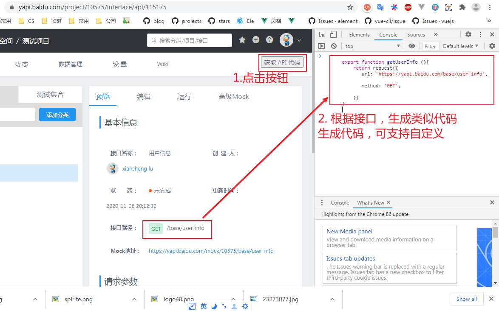
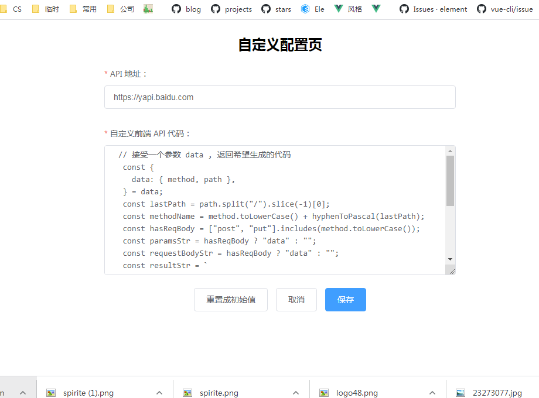
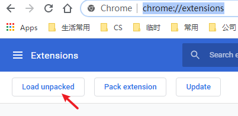
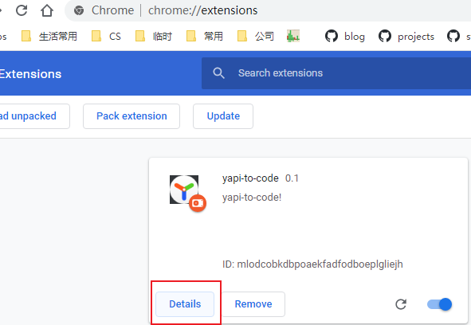
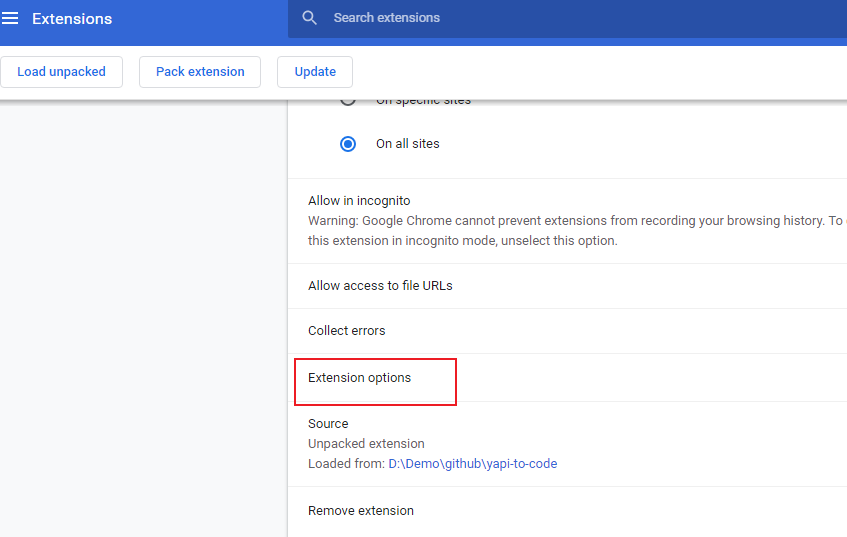

# yapi-to-code


A chrome extension to generate code for [yApi](https://github.com/YMFE/yapi).

## Usage





## Install

install by [chrome extension](https://chrome.google.com/webstore/detail/yapi-to-code/opdpdamkglmplgokmneddngabjpcailp)

Or

1. Download the release file _[dist.zip](https://github.com/xianshenglu/yapi-to-code/raw/master/dist.zip)_

```bash
git clone https://github.com/xianshenglu/yapi-to-code.git
```

2. Unzip the _dist.zip_ file.

3. Click the `Load unpacked` button in `chrome://extensions/` page and choose _dist_ folder.



4. Click the `detail` button



5. Scroll to bottom and click the `Extension options`



6. Configure the required fields Or you can configure it later after you get the generated code. **You must re-configure `API 地址` at least.**

7. Go back to your yApi site and reload!

8. Operate like [Usage](#usage) and go back to step 5 if you want.

## Todo

- [x] Highlight custom code
- [x] Generate Table code
- [ ] Generate mock response
- [ ] Automate the publish and changeLog generation.
- [ ] Refactor with vue3 and typescript.
- [ ] Generate formData
- [ ] Add tests
- [ ] Improve build config
