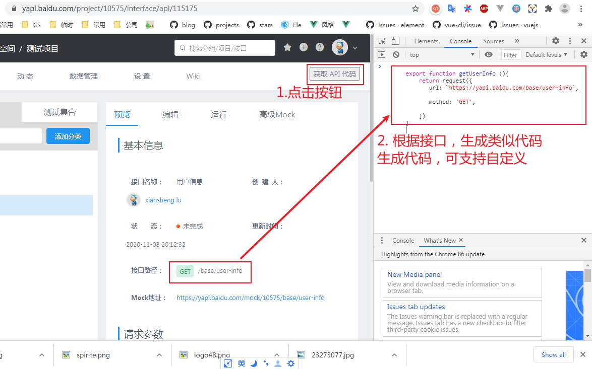
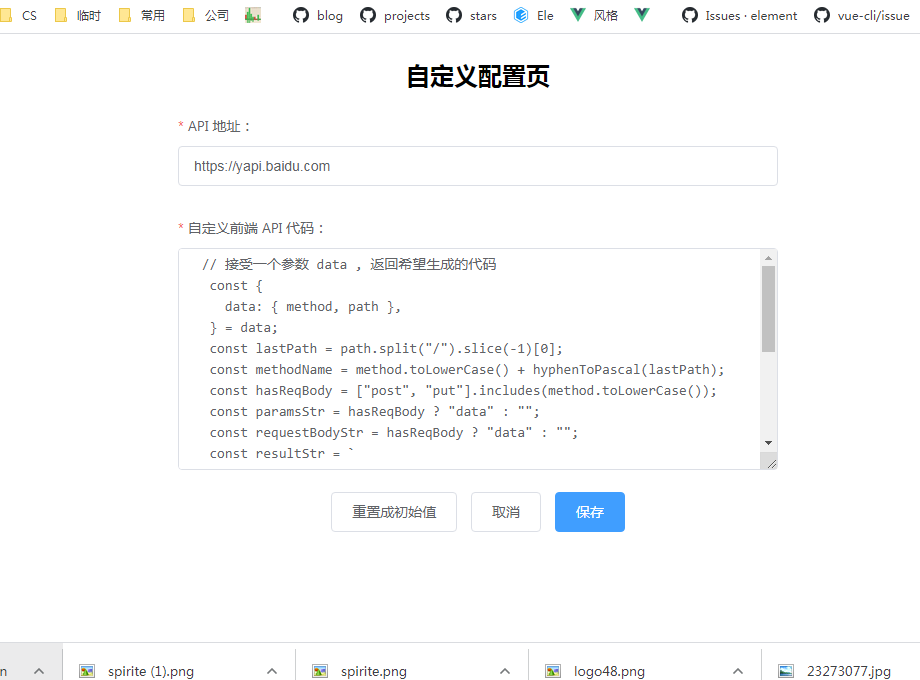
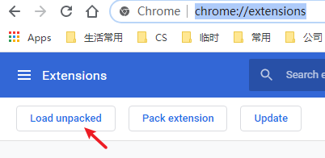
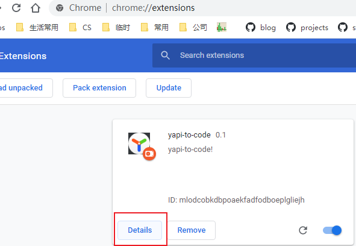
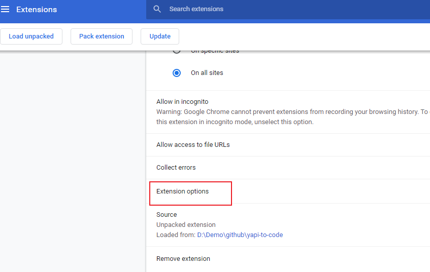

# yapi-to-code

先修 eslint 配置和依赖，在处理其
A chrome extension to generate code for [yApi](https://github.com/YMFE/yapi).

## Usage





## Install

~~install by [chrome extension]()~~

Or

1. clone the project

```bash
git clone https://github.com/xianshenglu/yapi-to-code.git
```

2. Click the `Load unpacked` button in `chrome://extensions/` page.



3. Click the `detail` button



1. Scroll to bottom and click the `Extension options`



1. Configure the required fields Or you can configure it later after you get the generated code.
2. Go back to your yApi site and reload!
3. Operate like [Usage](#usage) and go back to step 5 if you want.

## Todo

- [ ] Add tests
- [ ] Generate mock response
- [ ] Generate Element-ui Table code
- [ ] Generate formData
- [ ] Highlight custom code
- [ ] Improve build config
